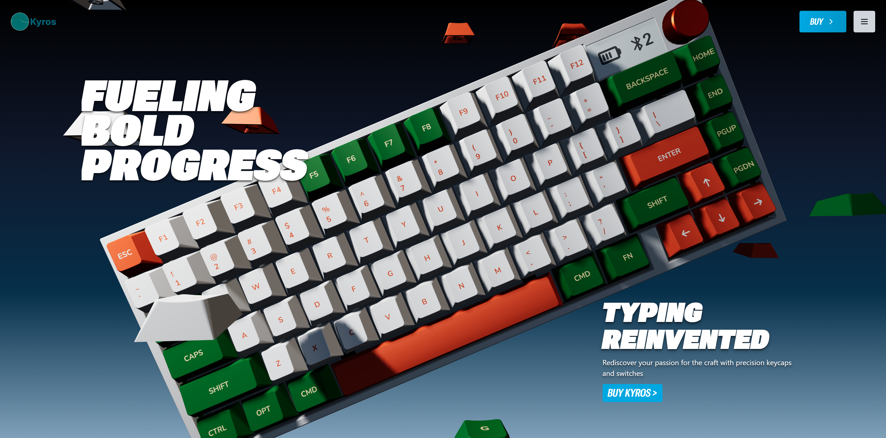

<div align="center">
  <br />
    <a href="https://kyroskeyboards.vercel.app/" target="_blank">
      
    </a>
  <br />

  <div>
    
        
        
    
  </div>

  <h3 align="center">Kyros Keyboards 3D Customizer UI</h3>

   <div align="center">
     Build a high-performance 3D product showcase and customizer UI for <a href="https://kyroskeyboards.vercel.app/" target="_blank"><b>Kyros Keyboards</b></a>
    </div>
</div>

## 📋 <a name="table">Table of Contents</a>

1. ✨ [Introduction](#introduction)
2. ⚙️ [Tech Stack](#tech-stack)
3. 🔋 [Features](#features)
4. 🤸 [Quick Start](#quick-start)


## <a name="introduction">✨ Introduction</a>

Build an immersive 3D Keyboard Customizer UI with React, **Three.js**, and **GSAP**! Implement seamless product configuration using **Zustand**, manage dynamic content via **Prismic** CMS, and deliver a cinematic user experience. Configure keyboard components, view real-time 3D models, and showcase products with smooth, engaging animations—all wrapped in a clean, reusable UI.


## <a name="tech-stack">⚙️ Tech Stack</a>

- **[React](https://react.dev/)** is a popular open‑source JavaScript library for building user interfaces using reusable components and a virtual DOM, enabling efficient, dynamic single-page and native apps.

- **[React Router v7](https://reactrouter.com/)** is the go‑to routing library for React apps, offering nested routes, data loaders/actions, error boundaries, code splitting, and SSR support—all with a smooth upgrade path from v6.

- **[Prismic](https://prismic.io/)** is a powerful headless CMS used for managing product data, marketing copy, and keyboard specifications, allowing non-developers to update content easily.

- **[Three.js](https://threejs.org/)** (via React Three Fiber) is the 3D graphics library used for rendering the interactive, customizable keyboard model directly in the browser.

- **[Tailwind CSS](https://tailwindcss.com/)** is a utility-first CSS framework that allows developers to design custom user interfaces by applying low-level utility classes directly in HTML, streamlining the design process.

- **[TypeScript](https://www.typescriptlang.org/)** is a superset of JavaScript that adds static typing, providing better tooling, code quality, and error detection for developers, making it ideal for building large-scale applications.

- **[Vite](https://vite.dev/)** is a fast build tool and dev server using native ES modules for instant startup, hot‑module replacement, and Rollup‑powered production builds—perfect for modern web development.

- **[Zustand](https://github.com/pmndrs/zustand)** is a minimal, hook-based state management library for React. It manages the global configuration state of the 3D customizer (e.g., color, keycaps, switches) with zero boilerplate.

- **[GSAP (GreenSock)](https://gsap.com/)** is the industry-standard animation library used to orchestrate smooth, cinematic, and high-performance UI and 3D camera movements.

## <a name="features">🔋 Features</a>

👉 **3D Product Customization**: Let users select and visualize custom keyboard components (case, keycaps, switches) with a live **Three.js** model.

👉 **Cinematic UI/UX**: Use **GSAP** for high-performance scroll-triggered animations and fluid transitions between product views.

👉 **Headless CMS Integration**: Dynamic content (product descriptions, pricing) is sourced from **Prismic**, enabling instant content updates.

👉 **Global State Management**: **Zustand** maintains the persistent state of the user's custom keyboard configuration across the application.

👉 **Reusable, modern UI**: Built with clean, consistent components for a great-looking and maintainable interface.

👉 **Code Reusability**: Leverage reusable components and a modular codebase for efficient development.

👉 **Cross-Device Compatibility**: Fully responsive design that works seamlessly across all devices.

👉 **Modern UI/UX**: Clean, responsive design built with Tailwind CSS and shadcn/ui for a sleek user experience.

And many more, including code architecture and reusability.

## <a name="quick-start">🤸 Quick Start</a>

Follow these steps to set up the project locally on your machine.

**Prerequisites**

Make sure you have the following installed on your machine:

- [Git](https://git-scm.com/)
- [Node.js](https://nodejs.org/en)
- [npm](https://www.npmjs.com/) (Node Package Manager)

**Cloning the Repository**

```bash
git clone [https://github.com/Vinciarya/ai-resume-analyzer.git](https://github.com/Vinciarya/ai-resume-analyzer.git)
cd ai-resume-analyzer